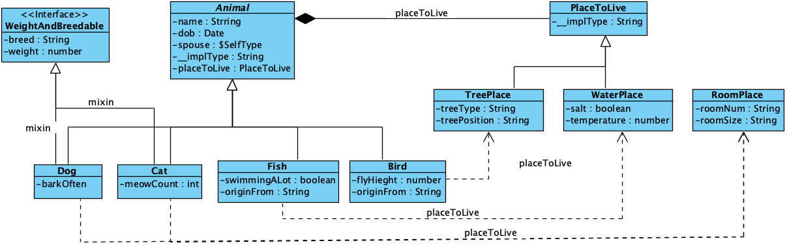

# Model inheritance in json schema 

In Json schema, it can use descriminator to model class inheritance, it is a little bit verbose, but it can be done. Here is a UML structure:



To model the inheritance and correlated property <code>placeToLive</code>, here is the schema:

```json
{
  "$schema": "http://json-schema.org/schema#",
  "type": "object",
  "definitions": {
    "WeightAndBreedable": {
      "type": "object",
      "properties": {
        "breed": {
          "type": "string"
        },
        "weight": {
          "type": "number"
        }
      },
      "required": [
        "breed"
      ]
    },
    "PlaceToLive": {
      "type": "object",
      "properties": {
        "__implType": {
          "type": "string"
        }
      },
      "required": [
        "__implType"
      ]
    },
    "TreePlace": {
      "allOf": [
        {
          "$ref": "#/definitions/PlaceToLive"
        },
        {
          "type": "object",
          "properties": {
            "treeType": {
              "type": "string"
            },
            "treePosition": {
              "type": "string",
              "enum": [
                "middle",
                "top",
                "branch"
              ]
            },
            "__implType": {
              "enum": [
                "livingTree"
              ]
            }
          },
          "required": [
            "treePosition"
          ]
        }
      ]
    },
    "RoomPlace": {
      "allOf": [
        {
          "$ref": "#/definitions/PlaceToLive"
        },
        {
          "type": "object",
          "properties": {
            "roomNum": {
              "type": "string"
            },
            "roomSize": {
              "type": "number"
            },
            "__implType": {
              "enum": [
                "livingRoom"
              ]
            }
          },
          "required": [
            "roomNum",
            "roomSize"
          ]
        }
      ]
    },
    "WaterPlace": {
      "allOf": [
        {
          "$ref": "#/definitions/PlaceToLive"
        },
        {
          "type": "object",
          "properties": {
            "salt": {
              "type": "boolean"
            },
            "temperature": {
              "type": "number"
            },
            "__implType": {
              "enum": [
                "livingWater"
              ]
            }
          },
          "required": [
            "salt",
            "temperature"
          ]
        }
      ]
    },
    "Animal": {
      "properties": {
        "name": {
          "type": "string"
        },
        "dob": {
          "type": "string",
          "format": "date"
        },
        "spouse": {
          "$ref": "#/definitions/Animal"
        },
        "placeToLive": {
          "$ref": "#/definitions/PlaceToLive"
        },
        "__implType": {
          "type": "string"
        }
      },
      "required": [
        "name",
        "__implType"
      ]
    },
    "Dog": {
      "allOf": [
        {
          "$ref": "#/definitions/Animal"
        },
        {
          "$ref": "#/definitions/WeightAndBreedable"
        },
        {
          "type": "object",
          "properties": {
            "barkOften": {
              "type": "boolean"
            },
            "__implType": {
              "enum": [
                "Dog"
              ]
            },
            "spouse": {
              "$ref": "#/definitions/Dog"
            },
            "placeToLive": {
              "$ref": "#/definitions/RoomPlace"
            }
          },
          "required": [
            "barkOften"
          ]
        }
      ]
    },
    "Cat": {
      "allOf": [
        {
          "$ref": "#/definitions/Animal"
        },
        {
          "type": "object",
          "properties": {
            "meowCount": {
              "type": "number"
            },
            "__implType": {
              "enum": [
                "Cat"
              ]
            },
            "spouse": {
              "$ref": "#/definitions/Cat"
            },
            "placeToLive": {
              "$ref": "#/definitions/RoomPlace"
            }
          },
          "required": [
            "meowCount"
          ]
        }
      ]
    },
    "Bird": {
      "allOf": [
        {
          "$ref": "#/definitions/Animal"
        },
        {
          "type": "object",
          "properties": {
            "flyHeight": {
              "type": "number"
            },
            "originFrom": {
              "type": "string"
            },
            "__implType": {
              "enum": [
                "Bird"
              ]
            },
            "spouse": {
              "$ref": "#/definitions/Bird"
            },
            "placeToLive": {
              "$ref": "#/definitions/TreePlace"
            }
          },
          "required": [
            "originFrom"
          ]
        }
      ]
    },
    "Fish": {
      "allOf": [
        {
          "$ref": "#/definitions/Animal"
        },
        {
          "type": "object",
          "properties": {
            "swimmingALot": {
              "type": "boolean"
            },
            "originFrom": {
              "type": "string"
            },
            "__implType": {
              "enum": [
                "Fish"
              ]
            },
            "spouse": {
              "$ref": "#/definitions/Fish"
            },
            "placeToLive": {
              "$ref": "#/definitions/WaterPlace"
            }
          },
          "required": [
            "originFrom"
          ]
        }
      ]
    }
  },
  "oneOf": [
    {
      "$ref": "#/definitions/Dog"
    },
    {
      "$ref": "#/definitions/Cat"
    },
    {
      "$ref": "#/definitions/Fish"
    },
    {
      "$ref": "#/definitions/Bird"
    }
  ]
}
```

 Dog, Cat, Fish and Bird have common properties inside Animal, and each has different properties too. They can only have the same type Animal as their spouse. Their living place is also restricted at each specific type level. A valid example is:

```json
{
  "name": "Max",
  "__implType": "Dog",
  "breed": "Toy poodle",
  "barkOften": true,
  "spouse": {
    "name": "Yellow",
    "__implType": "Dog",
    "breed": "Toy poodle",
    "barkOften": false
  },
  "placeToLive": {
    "__implType": "livingRoom",
    "roomNum": "8A",
    "roomSize": 100
  }
}
```


